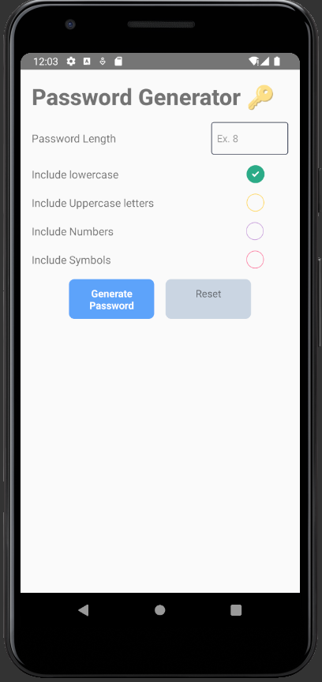

# PasswordGenerator 🔑

A secure 🔐 and safe password Generator app. using this user can generate any length of password by selecting available options.


## Download

Click the button below to download the APK for Android.

[](https://drive.google.com/file/d/1HLnf4mE-ulDienbK7JIFad_YWzBktkW4/view?usp=sharing)


**For Ios 🍎 avialbel soon...🚀


## Demo Images

Below are some screenshots of the PasswordGenerator 🔐 app:

### App Icon


### First Screen



## Steps for Developers

If you are a developer and want to fork this repository, follow the steps below:

1. **Fork the Repository**: Click on the 'Fork' button at the top right corner of this repository to create a copy in your GitHub account.

2. **Clone the Repository**: Clone the forked repository to your local machine using the following command:
    ```sh
    git clone https://github.com/your-username/PasswordGenerator.git
    ```
    Replace `your-username` with your GitHub username.

3. **Navigate to the Project Directory**:
    ```sh
    cd PasswordGenerator
    ```

4. **Install Dependencies**:
    ```sh
    npm install
    ```

5. **Set Up the Android Environment**:
    Make sure you have Android Studio and the Android SDK installed. Set up the necessary environment variables:
    ```sh
    export ANDROID_HOME=/path/to/your/android/sdk
    export PATH=$PATH:$ANDROID_HOME/tools:$ANDROID_HOME/platform-tools
    ```

6. **Run the App**:
    To run the app on an Android emulator or connected device:
    ```sh
    npx react-native run-android
    ```

7. **Generate a Release APK**:
    To generate a release APK, navigate to the `android` directory and run:
    ```sh
    cd android
    ./gradlew assembleRelease
    ```

    The APK will be generated at `android/app/build/outputs/apk/release/app-release.apk`.

Feel free to customize this README.md as per your project's requirements.
